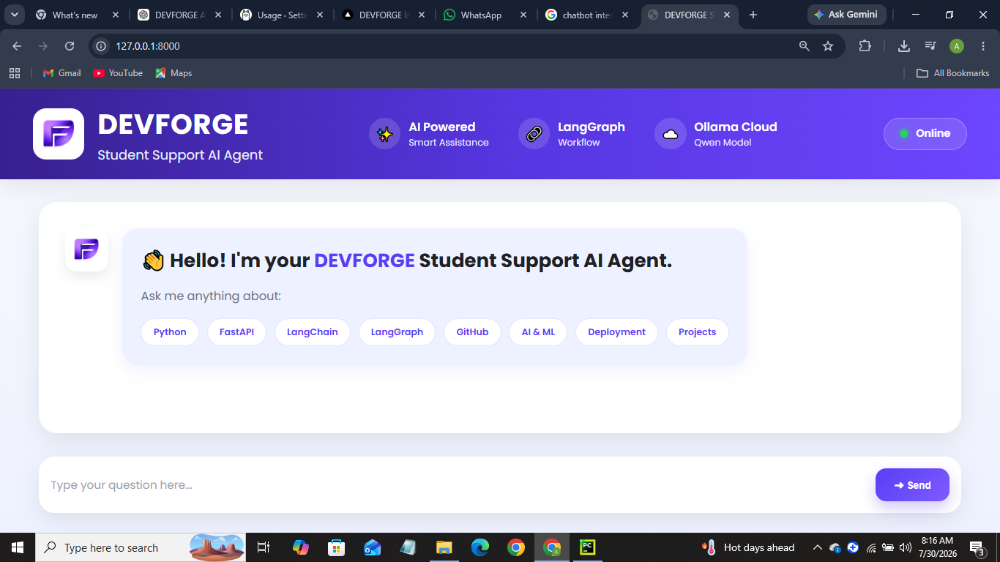
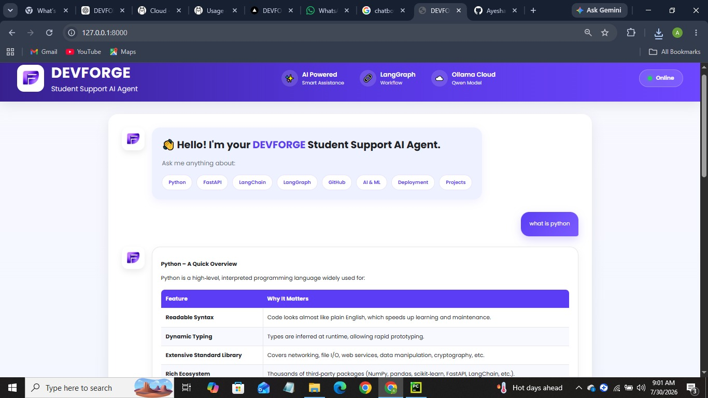

<p align="center">
  
</p>

<h1 align="center">🤖 DEVFORGE Student Support AI Agent</h1>

<p align="center">
An AI-powered Student Support Chatbot built with <strong>FastAPI</strong>, <strong>LangGraph</strong>, and <strong>Ollama Cloud</strong> to provide intelligent programming and technology assistance.
</p>

<p align="center">


</p>

---

# 📖 Overview

DEVFORGE Student Support AI Agent is an AI-powered educational chatbot developed using **FastAPI**, **LangGraph**, and **Ollama Cloud**. The application helps students understand programming concepts, Artificial Intelligence, Machine Learning, GitHub, deployment, FastAPI, and other technology-related topics through an interactive and responsive web interface.

---

# ✨ Features

- 🤖 AI-Powered Student Support Chatbot
- ⚡ FastAPI Backend
- 🔗 LangGraph Workflow Integration
- ☁️ Ollama Cloud API Integration
- 💬 Interactive Chat Interface
- 📝 Markdown Response Rendering
- 💾 Conversation History Support
- ⌨️ Typing Animation & Loading Indicator
- 🎨 Modern Responsive User Interface
- 🔐 Environment Variable Configuration
- 🚀 Ready for Cloud Deployment

---

# 🛠️ Tech Stack

### Backend

- Python
- FastAPI
- LangGraph
- LangChain
- Ollama Cloud
- Pydantic
- Jinja2
- Uvicorn

### Frontend

- HTML5
- CSS3
- JavaScript
- Marked.js

---

# 📂 Project Structure

```text
DEVFORGE-Student-Support-AI-Agent/
│
├── app/
│   ├── __init__.py
│   ├── agent.py
│   ├── classifier.py
│   ├── config.py
│   ├── graph.py
│   ├── llm.py
│   ├── models.py
│   ├── prompts.py
│   ├── state.py
│   └── utils.py
│
├── static/
│   ├── css/
│   │   └── style.css
│   ├── js/
│   │   └── script.js
│   └── images/
│       ├── logo.png
│       ├── home.png
│       └── chat.png
│
├── templates/
│   └── index.html
│
├── tests/
│
├── .env.example
├── .gitignore
├── koyeb.yaml
├── main.py
├── README.md
└── requirements.txt
```

---

# 🚀 Installation

### Clone Repository

```bash
git clone https://github.com/Ayesha1143/DEVFORGE-Student-Support-AI-Agent.git
```

---

### Navigate to Project

```bash
cd DEVFORGE-Student-Support-AI-Agent
```

---

### Create Virtual Environment

#### Windows

```bash
python -m venv .venv
.venv\Scripts\activate
```

#### Linux / macOS

```bash
python3 -m venv .venv
source .venv/bin/activate
```

---

### Install Dependencies

```bash
pip install -r requirements.txt
```

---

# 🔑 Environment Variables

Create a `.env` file using the following template:

```env
OLLAMA_API_KEY=your_api_key_here
OLLAMA_MODEL=gpt-oss:20b

APP_NAME=DEVFORGE Student Support AI Agent
APP_VERSION=1.0.0
```

---

# ▶️ Run the Application

```bash
uvicorn main:app --reload
```

Open your browser:

```
http://127.0.0.1:8000
```

---

# 📸 Application Preview

## 🏠 Home Screen

<p align="center">
  
</p>

---

## 💬 Chat Interface

<p align="center">
  
</p>

---

# 📌 API Endpoints

| Method | Endpoint | Description |
|----------|----------|-------------|
| GET | `/` | Home Page |
| POST | `/chat` | Chat with AI Agent |
| GET | `/health` | Health Check |
| GET | `/info` | Application Information |

---

# 💡 Example Questions

You can ask questions like:

- What is Python?
- Explain FastAPI.
- What is LangGraph?
- Difference between AI and Machine Learning.
- Explain GitHub branches.
- How to deploy a FastAPI application?
- What is Retrieval-Augmented Generation (RAG)?
- Explain Object-Oriented Programming.

---

# 🎯 Future Improvements

- 🎙️ Voice Interaction
- 🌙 Dark Mode
- 📄 PDF Question Answering
- 👤 User Authentication
- 💾 Database Chat History
- 🌍 Multi-language Support
- 🔄 AI Model Switching
- 📊 Analytics Dashboard

---

# 👩‍💻 Developer

**Ayesha**

BS Artificial Intelligence Student

GitHub: https://github.com/Ayesha1143

---

# 📄 License

This project is developed for educational and learning purposes.

---

<p align="center">

⭐ If you found this project useful, consider giving it a **Star** on GitHub.

</p>
